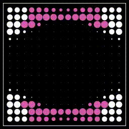
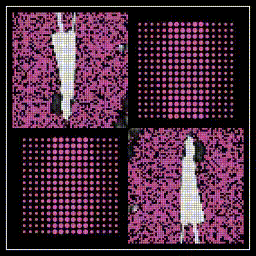
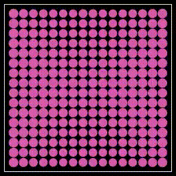
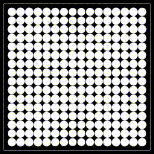
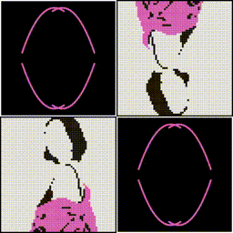
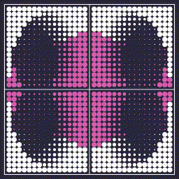

**2022-07-08** fixed-size representations are easier than
variable-size representations. i want a fixed-size representation for
program synthesis. using a fixed-size sequence of tokens seems wrong;
that space of programs is almost accidental, because some tokens are
boilerplate. an adjacency matrix seems like a better place to start.

  

**2022-07-07** refactor, put #dailycoding stuff in its own file.

i want to use a form of unityped functional programming for 2d
graphics. every value is a time-varying display rewrite, called a
filter.

**2022-07-01** daily. not done with this one, gonna add a flow field
or something to it.

**2022-06-30** im gonna start doing #dailycoding again

**2022-06-23** i wanna make toy neural nets. it would be cool to use
language model evolution for neural architecture search. also i wanna
make a "foundation model" for a fantasy console like [pico
8](https://www.lexaloffle.com/pico-8.php) or even
[orca](https://wiki.xxiivv.com/site/orca.html).

**2022-06-21** id like to try something like [language model
evolution](https://arxiv.org/abs/2206.08896) with dalle mini. rn my
idea is a domain specific language for signal processing, embedded in
python, using dalle as some type of intelligent library.

one thing i want to think about is how to use dalle for generic image
processing tasks, rather than only open-ended image
generation. openais dalle2 is already being used to edit images, so
there should be a way to do something similar with dalle mini.

i think markov algorithms are a good paradigm for the embedded
language. [markovjunior](https://github.com/mxgmn/MarkovJunior) is a
recent project that i liked a lot.

**2022-06-20** i started working on utility code for dalle mini. also
a really cool paper called [evolution through large
models](https://arxiv.org/abs/2206.08896) just dropped and id like to
try some of that with gpt3 and python.

**2022-06-17** i love the ["rulial space
program"](https://writings.stephenwolfram.com/2022/06/alien-intelligence-and-the-concept-of-technology/)
image, and i feel like [this description of
games](https://writings.stephenwolfram.com/2022/06/games-and-puzzles-as-multicomputational-systems/)
validates my interest in computability logic and game semantics.

**2022-06-16** i think transformer sequence models are simple,
intuitive, and universal, so i want to try to use them for generative
art. i think i can train really small transformers on stuff like
length 16/64 sequences, or maybe 16x16 or 64x64 graphics. another idea
is to replace pixels with code and predict spatial arrangements of
programs, like a seq2seq picture field.

**2022-06-16** i think it would be cool to use generative grammars and
neural nets to draw pictures. i want to combine [markov
algorithms](https://github.com/mxgmn/MarkovJunior) and [computability
logic](http://www.csc.villanova.edu/~japaridz/CL/) to make a language
like this.

**2022-06-16** [tixy](https://tixy.land) is pretty cool so i
implemented that.

